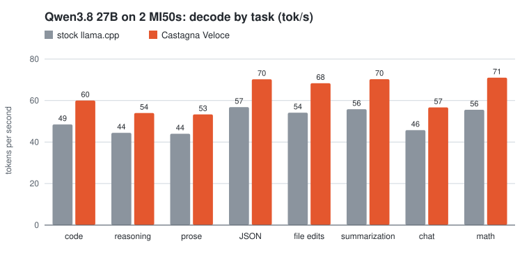
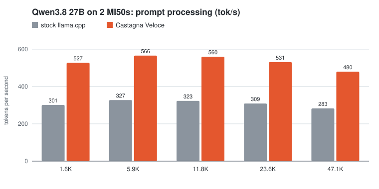

# Qwen3.8 27B benchmarks

Castagna Veloce against stock llama.cpp, on the same model and the same kind of cards: two
MI50s each, run side by side and measured with [BetterBench](https://github.com/GGZ14/BetterBench).
Positive gain favors Castagna Veloce.

| | Stock llama.cpp | Castagna Veloce |
| --- | --- | --- |
| Engine | llama.cpp v0.5.0 (`7fe450e`), built for `gfx906` | Castagna Veloce (`497e40537`) |
| Cards | 2 × MI50 32 GB: GPU 0 (x16) + GPU 1 (x8) | 2 × MI50 32 GB: GPU 2 (x16) + GPU 3 (x8) |
| Model | Qwen3.8-27B UD-Q4_K_XL, MTP Q4_0 draft (2 tokens) | the same files |
| Server | `-sm tensor -fa on -c 65536 -ub 1024 -np 1` | the same, as in its [model guide](qwen3.8-27b.md#serve) |

Both servers ran at the same time on the same host (ROCm 7.1, Ubuntu 26.04), and BetterBench
`bdd9bd5` (v0.6.0) ran on that host too. Measured 2026-10-06.

## Head to head (paired A/B)

BetterBench `ab`: 129 interleaved request pairs, greedy, the same prompt sent to both engines
back to back, stopped once the 95% confidence interval was within ±1%.

| Metric | Stock llama.cpp | Castagna Veloce | Difference | 95% CI | Verdict |
| --- | ---: | ---: | ---: | --- | --- |
| Decode (tok/s) | 55.0 | 67.9 | +23.4% | [+22.4%, +24.4%] | significant |

BetterBench also compares the median gap between streamed updates. With speculative decoding the
tokens arrive in bursts, and that comparison came out inconclusive (95% CI [-319%, +953%]), so
it is left out.

## Single user, decode by task

BetterBench `run`, sampled (temperature 0.7), thinking on, median of each category's measured
requests. Decode is the rate after the first token; TTFT is the time to the first token.

| Category | Stock tok/s | Castagna tok/s | Gain | Stock TTFT (ms) | Castagna TTFT (ms) |
| --- | ---: | ---: | ---: | ---: | ---: |
| code | 48.5 | 60.0 | +23.8% | 1,054 | 675 |
| reasoning | 44.5 | 54.0 | +21.5% | 1,003 | 653 |
| prose | 44.0 | 53.3 | +21.1% | 986 | 635 |
| JSON | 56.8 | 70.3 | +23.6% | 1,054 | 669 |
| file edits | 54.2 | 68.4 | +26.2% | 1,111 | 699 |
| summarization | 55.8 | 70.3 | +25.9% | 1,115 | 689 |
| chat | 45.8 | 56.7 | +24.0% | 1,500 | 923 |
| math | 55.6 | 71.0 | +27.8% | 1,002 | 647 |
| **weighted** | **49.6** | **61.2** | **+23.5%** | | |

## Single user, prompt processing by depth

BetterBench `run`, prompt of the given length (unique per request), 16 output tokens, median of
the measured requests.

| Prompt (tokens) | Stock tok/s | Castagna tok/s | Gain | Stock TTFT (s) | Castagna TTFT (s) |
| ---: | ---: | ---: | ---: | ---: | ---: |
| 1,556 | 301.3 | 527.3 | +75.0% | 5.16 | 2.96 |
| 5,934 | 327.3 | 565.6 | +72.8% | 18.07 | 10.48 |
| 11,842 | 323.1 | 559.8 | +73.2% | 36.67 | 21.18 |
| 23,590 | 309.1 | 530.7 | +71.7% | 76.34 | 44.45 |
| 47,056 | 282.7 | 479.6 | +69.7% | 166.32 | 98.13 |

## How it was measured

- **Decode by task and prompt processing** use `betterbench run` with its default settings:
  sampled (temperature 0.7, top-p 0.95, top-k 20) and thinking on, the model's default. Each
  category gets 3 warm-up and 20 measured requests. Many requests stop at the corpus's
  `max_tokens` while still thinking; decode speed is measured either way, the same for both
  engines. Each prompt length gets 2 warm-up and 8 measured requests, every prompt unique.
- **Head to head** uses `betterbench ab`: greedy, with the same prompts alternating between the
  two engines, which cancels drift over time.
- **Not measured here:** several users at once (both servers run one slot, the setup Castagna
  Veloce is tuned for), loading time and memory.
- The stock build is a Release build for `gfx906` with flash attention and HIP graphs on, against
  the same ROCm.

Raw results, as BetterBench wrote them:
- `results.json`: [stock](artifacts/qwen3.8-27b/betterbench-stock.json.gz) and
  [Castagna Veloce](artifacts/qwen3.8-27b/betterbench-castagna.json.gz) (gzip), and
  [A/B](artifacts/qwen3.8-27b/betterbench-ab.json).
- HTML reports (download and open in a browser): [stock](artifacts/qwen3.8-27b/betterbench-stock.html)
  and [Castagna Veloce](artifacts/qwen3.8-27b/betterbench-castagna.html).
